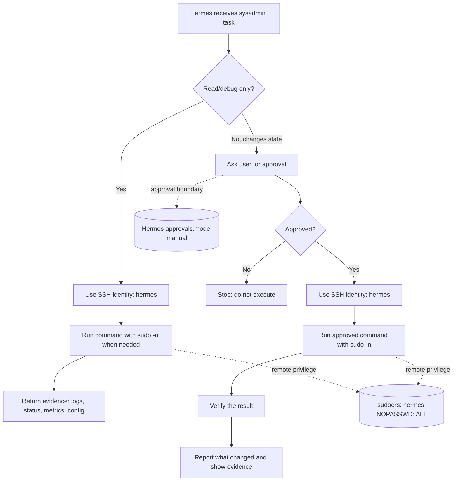

# Hermes SSH Access Setup

SSH access model for Hermes Agent on Linux VMs using a single `hermes` account with passwordless sudo and Hermes-side approval for non-read execution.

## Goals

Hermes should be able to administer Linux VMs over SSH without getting blocked by interactive prompts, while still preserving a clear operator workflow:

1. **Read/debug actions run directly**
   - Read logs.
   - Inspect service state.
   - Inspect processes, ports, routes, disk, memory, mounts, and configuration.
   - Gather evidence quickly without manual confirmation.

2. **Non-read actions require user approval before execution**
   - Write files under privileged paths such as `/root` or `/etc`.
   - Restart, reload, enable, or disable services.
   - Install, remove, or update packages.
   - Change permissions, ownership, firewall state, storage state, or any other system state.

Important constraint: **do not use an interactive remote `sudo` password prompt as the approval model.** Hermes cannot reliably operate a remote interactive `sudo` password prompt through tool-driven SSH sessions. The practical model is:

- one SSH identity: `hermes`;
- target-side sudo grants `hermes` full passwordless sudo;
- Hermes approval mode decides whether a non-read command may be submitted;
- SSH, sudo, journald, auditd, and central logs provide accountability.

## Threat Model / Trust Boundaries

This setup treats Hermes as a trusted automation operator. It is not a sandbox for an untrusted model.

Because Hermes can use the configured SSH key on its own, separating `hermes-read` and `hermes-admin` identities is not a strong security boundary unless the Hermes runtime itself is prevented from accessing the admin key. If the same Hermes runtime can choose either key, two users mostly improve logging and attribution, not security.

The chosen model is therefore intentionally simple:

| Boundary | Decision |
|---|---|
| Remote Unix identity | Single `hermes` user |
| Remote sudo policy | `hermes ALL=(ALL) NOPASSWD: ALL` |
| Approval boundary | Hermes must ask before non-read/system-changing execution |
| Logging boundary | Host logs record SSH login and sudo commands by `hermes` |

This means target-side sudo does **not** prevent Hermes from changing the system. The prevention point is Hermes approval behavior and operator discipline. If Hermes is run with approval bypass / YOLO mode, this model becomes effectively unattended passwordless root over SSH.

## Recommended Architecture

Use one Unix account and one SSH key:

| Identity | Purpose | sudo model | Hermes approval |
|---|---|---|---|
| `hermes` | All diagnostics and approved administration | `NOPASSWD: ALL` | Required for non-read commands |

Recommended Hermes configuration:

```bash
hermes config set approvals.mode manual
```

`smart` can be evaluated later, but start with `manual` for sysadmin access. Do **not** use YOLO mode for production systems.

### Read vs non-read rule

A command is **read/debug** when it only observes system state and does not persistently change files, services, packages, users, firewall rules, kernel settings, mounts, or data.

Examples that usually count as read/debug:

```text
journalctl, systemctl status, systemctl show, ss, ip addr, ip route,
ps, top, free, df, du, cat, tail, grep, find without -delete/-exec,
sudo -l, getent, id, ls, stat
```

Examples that are **non-read** and require approval:

```text
systemctl restart|reload|enable|disable|start|stop
apt|apt-get|dnf|yum|apk|rpm package changes
tee/cp/mv/rm/install/chmod/chown to privileged paths
useradd/usermod/groupadd/passwd
mount/umount
firewall-cmd/iptables/nft/ufw changes
sysctl -w or writes under /proc/sys
any shell pipeline whose purpose is to modify state
```

### Approval flow



Equivalent ASCII view:

```text
Task received
     |
     v
Read/debug only? ---- yes ----> hermes SSH ----> sudo -n if needed ----> evidence
     |
     no
     v
Ask user approval ---- no ----> stop
     |
    yes
     v
hermes SSH ----> approved sudo command ----> verify change ----> report evidence
```

## FreeIPA Setup

These examples use current FreeIPA CLI syntax and avoid an interactive sudo password model.

### 1. Create the `hermes` user and SSH key

Run on a FreeIPA admin host with valid Kerberos credentials:

```bash
kinit admin

ipa user-add hermes \
  --first=Hermes \
  --last=Agent \
  --email=hermes@example.com \
  --shell=/bin/bash

ipa user-mod hermes \
  --sshpubkey="ssh-ed25519 AAAA... hermes@example.com"
```

Verify:

```bash
ipa user-show hermes
```

### 2. Allow sudo through HBAC

FreeIPA HBAC for sudo must allow the **Sudo service group**:

```bash
ipa hbacrule-add "hermes-sudo"
ipa hbacrule-add-user "hermes-sudo" --users=hermes
ipa hbacrule-add-service "hermes-sudo" --hbacsvcgroups=Sudo
ipa hbacrule-mod "hermes-sudo" --hostcat=all
```

Do not use `--hbacsvcs=Sudo` for this rule. The service group form is required here.

Verify:

```bash
ipa hbacrule-show "hermes-sudo"
```

Expected essentials:

```text
Rule name: hermes-sudo
Host category: all
Users: hermes
HBAC Service Groups: Sudo
```

### 3. Create the full sudo rule

Use one sudo rule granting full passwordless sudo to `hermes`:

```bash
ipa sudorule-add "hermes-all" \
  --desc="Full passwordless sudo for Hermes Agent; non-read commands require Hermes approval" \
  --hostcat=all \
  --runasusercat=all \
  --runasgroupcat=all \
  --cmdcat=all

ipa sudorule-add-user "hermes-all" --users=hermes
ipa sudorule-add-option "hermes-all" --sudooption='!authenticate'
```

`!authenticate` is the FreeIPA sudo option form for `NOPASSWD`.

### 4. Verify FreeIPA rules

On the FreeIPA server or admin host:

```bash
ipa sudorule-show "hermes-all"
ipa hbacrule-show "hermes-sudo"
ipa user-show hermes
```

On each enrolled target host:

```bash
getent passwd hermes
id hermes
sudo sss_cache -E
sudo systemctl restart sssd
sudo -l -U hermes
```

Expected sudo listing should include unrestricted passwordless sudo for `hermes`, equivalent to:

```text
(root) NOPASSWD: ALL
```

## Standalone Host Setup with Ansible

For non-FreeIPA hosts such as Alpine, Debian/Ubuntu, or RHEL-family systems, use the playbook in this repository:

```text
ansible/deploy-hermes-ssh-access.yml
```

The playbook:

- creates the local `hermes` user;
- installs the configured SSH public key;
- installs `sudo` where required;
- writes `/etc/sudoers.d/10-hermes`;
- grants `hermes ALL=(ALL) NOPASSWD: ALL`;
- validates the sudoers file with `visudo -cf %s` before installation;
- handles Alpine, Debian/Ubuntu, and RHEL-family package installation.

Example run:

```bash
ansible-playbook \
  -i inventory.ini \
  ansible/deploy-hermes-ssh-access.yml \
  -e hermes_ssh_public_key='ssh-ed25519 AAAA... hermes@example.com'
```

For production, prefer Ansible Vault, inventory variables, or a secure controller-side variable source for keys instead of long command-line variables.

## Verification

### SSH access

```bash
ssh -i ./hermes.key hermes@host.example.com 'whoami; id; hostname -f'
```

### sudo access

These should work without a remote password:

```bash
ssh -i ./hermes.key hermes@host.example.com 'sudo -n whoami'
ssh -i ./hermes.key hermes@host.example.com 'sudo -n -l'
ssh -i ./hermes.key hermes@host.example.com 'sudo -n journalctl --no-pager -n 3'
```

Expected:

```text
root
```

and `sudo -l` should show passwordless `ALL` for `hermes`.

### Read/debug example

No approval should be needed for read-only inspection:

```bash
ssh -i ./hermes.key hermes@host.example.com 'sudo -n systemctl status sshd --no-pager'
ssh -i ./hermes.key hermes@host.example.com 'sudo -n ss -tlnp'
ssh -i ./hermes.key hermes@host.example.com 'sudo -n df -h'
```

### Non-read example

Hermes should ask for approval before submitting commands like this:

```bash
ssh -i ./hermes.key hermes@host.example.com 'echo test | sudo -n tee /root/hermes-test.txt'
ssh -i ./hermes.key hermes@host.example.com 'sudo -n rm -f /root/hermes-test.txt'
```

After approval and execution, verify the result and collect evidence from logs:

```bash
ssh -i ./hermes.key hermes@host.example.com 'sudo -n journalctl _COMM=sudo --no-pager -n 20'
```

## Operational Guidance

- Keep Hermes approval mode enabled for sysadmin work: `hermes config set approvals.mode manual`.
- Do not use YOLO mode for production systems with this SSH key.
- Treat the `hermes` SSH key as privileged. It is effectively passwordless root on every target where this setup is installed.
- Scope FreeIPA rules and SSH deployment by host groups where possible instead of using `--hostcat=all` permanently.
- Rotate the `hermes` SSH key according to your privileged-access policy.
- Prefer explicit commands and verification: inspect first, ask for approval for non-read changes, execute, then prove the result.
- Log centrally. At minimum, collect SSH authentication logs and sudo logs. For stronger accountability, forward journald/auditd events to the central logging platform.
- Document which Hermes profile or runtime is allowed to hold and use the `hermes` private key.

## Limitations

- This model is not a target-side security boundary. The target grants `hermes` full passwordless sudo.
- The approval boundary exists in Hermes. If Hermes approval is bypassed or misconfigured, the remote host will not stop state-changing commands.
- `NOPASSWD` is intentional. The alternative, an interactive sudo password prompt, is not reliable for Hermes SSH automation.
- A compromised Hermes runtime or leaked `hermes` private key can perform root actions on allowed hosts.
- Separate Unix users can still be useful for logging, attribution, or key lifecycle management, but they are not a security gain if the same Hermes runtime can access all keys.
