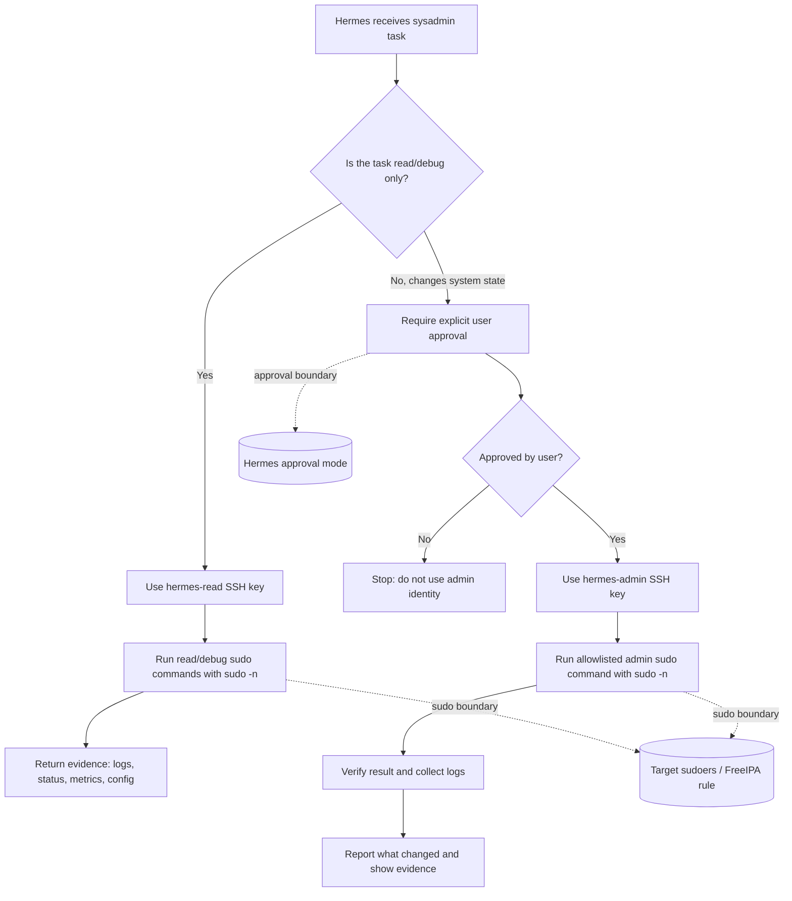

# Hermes SSH Access Setup

Secure SSH access for Hermes Agent on Linux VMs with a clean separation between unattended diagnostics and explicitly approved administration.

## Goals

Hermes needs two different operational modes when connecting to remote Linux systems over SSH:

1. **Read/debug access with minimal friction**
   - Read logs.
   - Inspect service state.
   - Inspect processes, ports, network routes, disk, memory, and mounts.
   - Read relevant configuration files.
   - Run without an interactive confirmation for routine diagnostics.

2. **Write/admin access only after user approval**
   - Write files under privileged paths such as `/root` or `/etc`.
   - Restart, reload, enable, or disable services.
   - Install, remove, or update packages.
   - Change system state.

Important constraint: **do not use an interactive remote `sudo` password prompt as the approval model.** Hermes cannot reliably operate a remote interactive `sudo` password prompt through tool-driven SSH sessions. The useful control points are:

- SSH identity and host scoping.
- sudo command scoping on the target host.
- Hermes-side command approval before state-changing actions.
- sudo, journald, auditd, and central log forwarding for accountability.

## Threat Model / Trust Boundaries

This setup assumes Hermes is a powerful operator tool, not a sandbox boundary. If Hermes is allowed to run a command as root with `NOPASSWD`, that command must be treated as available to the agent whenever that SSH identity is selected.

Trust boundaries:

| Boundary | What it controls | What it does not control |
|---|---|---|
| SSH key | Which remote identity Hermes can use | What that identity can do after login |
| sudo rule | Which root commands the identity can execute | Whether the command is safe for every argument |
| Hermes approval | Whether a state-changing command is submitted by the agent | Target-side enforcement if Hermes is misconfigured or run in YOLO mode |
| Logging | Accountability and investigation | Prevention |

The original one-user model with `hermes-read` and `hermes-write` sudo rules is not a clean boundary when both rules apply to the same Unix account. A binary allowlist such as `/usr/bin/systemctl` cannot distinguish `systemctl status` from `systemctl restart` unless the sudo command entry also includes arguments. If `/usr/bin/systemctl` is in a `NOPASSWD` read rule, then `sudo systemctl restart ...` is also allowed through that same rule.

## Recommended Architecture

Use **two Unix identities and two SSH keys**:

| Identity | Purpose | SSH key | sudo model | Hermes approval |
|---|---|---|---|---|
| `hermes-read` | Routine diagnostics | read key | `NOPASSWD` for read-oriented commands only | Not required for normal diagnostics |
| `hermes-admin` | State-changing operations | admin key | `NOPASSWD` for admin commands only | Required before using this identity or running admin commands |

This is the cleanest practical model because the identity itself becomes part of the security boundary. If Hermes is connected as `hermes-read`, admin commands are not available even if the agent approval layer is misconfigured. To make changes, Hermes must use the `hermes-admin` key and should only do that after explicit user confirmation.

### Approval flow



Equivalent ASCII view:

```text
Task received
     |
     v
Read/debug only? ---- yes ----> hermes-read key ----> read sudo allowlist ----> evidence
     |
     no
     v
User approval required ---- no ----> stop
     |
    yes
     v
hermes-admin key ----> admin sudo allowlist ----> verify change ----> report evidence
```

### Architecture comparison

#### A. One user: `hermes`

Model:

- One SSH key.
- One Unix account.
- sudo has a limited `NOPASSWD` allowlist.
- Hermes approval controls whether write/admin commands are attempted.

Pros:

- Simple to deploy.
- Simple to explain.
- Works for low-risk lab systems.

Cons:

- Weak separation between read and write actions.
- If the read sudo rule includes a multi-purpose binary such as `systemctl`, `mount`, `tee`, `cp`, `find`, or an editor, sudo cannot infer the operator's intent from the binary path alone.
- If Hermes runs in YOLO mode or approval detection is wrong, the same account may already have the privileged command available.

Recommendation: use only for disposable labs or fully trusted hosts where the operational risk is accepted.

#### B. Two users / two SSH keys: `hermes-read` and `hermes-admin`

Model:

- Separate SSH keys.
- Separate Unix accounts.
- `hermes-read` gets only read/debug sudo commands.
- `hermes-admin` gets admin/write sudo commands.
- Switching to `hermes-admin` is the explicit approval boundary.

Pros:

- Stronger and easier to audit.
- A read-only session cannot accidentally restart services or install packages.
- Key rotation and host scoping can differ between read and admin access.
- Works consistently for FreeIPA and standalone hosts.

Cons:

- More setup than a single account.
- Hermes workflows must know which SSH identity to use.

Recommendation: **default production architecture**.

#### C. Argument-based sudo rules

Model:

- sudo command entries include command arguments, for example a command specification equivalent to `systemctl status *`.
- Restart/reload/enable/disable are separate admin command entries.

FreeIPA and sudo/SSSD can represent sudo command strings, and sudo itself supports command specifications with arguments. This can be useful for narrowing high-risk tools. However, argument matching is not a complete security model for Hermes sysadmin access:

- It is easy to miss alternative read/write subcommands or aliases.
- Shell quoting and wildcard matching must be reviewed carefully.
- Some tools are inherently multi-purpose and hard to constrain safely by arguments.
- A rule like `cat *` may be read-only but still exposes every readable secret as root.
- A rule like `find *` can become dangerous if `-exec`, `-delete`, or writable paths are allowed.

Recommendation: use argument-based sudo rules only as an additional hardening layer for specific well-understood commands. Do not rely on them as the main read/write separation for Hermes. Prefer two identities.

## FreeIPA Setup

These examples use current FreeIPA CLI syntax and avoid an interactive sudo password model.

### 1. Create users and SSH keys

Run on a FreeIPA admin host with valid Kerberos credentials:

```bash
kinit admin

ipa user-add hermes-read \
  --first=Hermes \
  --last=Read \
  --email=hermes-read@example.com \
  --shell=/bin/bash

ipa user-add hermes-admin \
  --first=Hermes \
  --last=Admin \
  --email=hermes-admin@example.com \
  --shell=/bin/bash

ipa user-mod hermes-read \
  --sshpubkey="ssh-ed25519 AAAA... hermes-read@example.com"

ipa user-mod hermes-admin \
  --sshpubkey="ssh-ed25519 AAAA... hermes-admin@example.com"
```

Verify:

```bash
ipa user-show hermes-read
ipa user-show hermes-admin
```

### 2. Allow sudo through HBAC

FreeIPA HBAC for sudo must allow the **Sudo service group**:

```bash
ipa hbacrule-add "hermes-sudo"
ipa hbacrule-add-user "hermes-sudo" --users=hermes-read
ipa hbacrule-add-user "hermes-sudo" --users=hermes-admin
ipa hbacrule-add-service "hermes-sudo" --hbacsvcgroups=Sudo
ipa hbacrule-mod "hermes-sudo" --hostcat=all
```

Do not use `--hbacsvcs=Sudo` for this rule. The service group form is required here.

Verify:

```bash
ipa hbacrule-show "hermes-sudo"
```

Expected essentials:

```text
Rule name: hermes-sudo
Host category: all
Users: hermes-read, hermes-admin
HBAC Service Groups: Sudo
```

### 3. Create sudo command objects

Use command groups so the rules are easier to maintain.

Read/debug commands should avoid tools that can directly change system state. Do **not** put plain `/usr/bin/systemctl`, `/usr/bin/mount`, `/usr/bin/umount`, package managers, editors, `tee`, `cp`, `mv`, or `install` in the read group.

```bash
ipa sudocmdgroup-add hermes-read-commands \
  --desc="Read/debug commands for Hermes read identity"

for cmd in \
  /usr/bin/journalctl \
  /usr/bin/dmesg \
  /usr/bin/ss \
  /usr/sbin/ss \
  /sbin/ip \
  /usr/sbin/ip \
  /usr/bin/free \
  /usr/bin/df \
  /usr/bin/du \
  /usr/bin/lsof \
  /usr/bin/tail \
  /usr/bin/cat \
  /bin/ls \
  /usr/bin/find \
  /usr/bin/grep \
  /usr/bin/nproc \
  /usr/bin/ps \
  /usr/bin/w \
  /usr/bin/uptime; do
  ipa sudocmd-add "$cmd" || true
  ipa sudocmdgroup-add-member hermes-read-commands --sudocmds="$cmd"
done

ipa sudocmdgroup-add hermes-admin-commands \
  --desc="Admin/write commands for Hermes admin identity"

for cmd in \
  /usr/bin/systemctl \
  /usr/bin/tee \
  /usr/bin/install \
  /usr/bin/cp \
  /usr/bin/mv \
  /usr/bin/rm \
  /usr/bin/chown \
  /usr/bin/chmod \
  /usr/bin/dnf \
  /usr/bin/yum \
  /usr/bin/apt \
  /usr/bin/apt-get \
  /sbin/apk \
  /usr/sbin/service \
  /sbin/rc-service; do
  ipa sudocmd-add "$cmd" || true
  ipa sudocmdgroup-add-member hermes-admin-commands --sudocmds="$cmd"
done
```

If you want argument-based hardening for a specific command, create a separate command object and test it on an enrolled host with `sudo -l -U <user>` and real executions. Treat this as defense-in-depth, not as the primary model.

### 4. Create the read sudo rule

```bash
ipa sudorule-add "hermes-read" \
  --desc="Read/debug sudo for Hermes read identity" \
  --hostcat=all

ipa sudorule-add-user "hermes-read" --users=hermes-read
ipa sudorule-add-allow-command "hermes-read" --sudocmdgroups=hermes-read-commands
ipa sudorule-add-option "hermes-read" --sudooption='!authenticate'
```

`!authenticate` is the FreeIPA sudo option form for `NOPASSWD`.

### 5. Create the admin sudo rule

This rule is also `NOPASSWD`, because Hermes must not depend on a remote interactive sudo password prompt. Approval happens before Hermes uses the admin SSH identity or submits state-changing commands.

```bash
ipa sudorule-add "hermes-admin" \
  --desc="Admin/write sudo for Hermes admin identity" \
  --hostcat=all

ipa sudorule-add-user "hermes-admin" --users=hermes-admin
ipa sudorule-add-allow-command "hermes-admin" --sudocmdgroups=hermes-admin-commands
ipa sudorule-add-option "hermes-admin" --sudooption='!authenticate'
```

### 6. Verify FreeIPA rules

On the FreeIPA server or admin host:

```bash
ipa sudorule-show "hermes-read"
ipa sudorule-show "hermes-admin"
ipa sudocmdgroup-show hermes-read-commands
ipa sudocmdgroup-show hermes-admin-commands
ipa hbacrule-show "hermes-sudo"
```

On each enrolled target host:

```bash
getent passwd hermes-read
getent passwd hermes-admin
id hermes-read
id hermes-admin
sudo sss_cache -E
sudo systemctl restart sssd
sudo -l -U hermes-read
sudo -l -U hermes-admin
```

Expected:

- `hermes-read` can list and run only read/debug commands.
- `hermes-admin` can list and run admin/write commands.
- Both rules show `NOPASSWD` / `!authenticate`.
- sudo access works through HBAC with the `Sudo` service group.

## Standalone Host Setup with Ansible

For non-FreeIPA hosts such as Alpine, Debian/Ubuntu, or RHEL-family systems, use the playbook in this repository:

```text
ansible/deploy-hermes-ssh-access.yml
```

The playbook:

- Creates `hermes-read` and `hermes-admin` users.
- Installs separate SSH public keys.
- Installs `sudo` where required.
- Detects command paths that actually exist on the target.
- Writes sudoers drop-ins under `/etc/sudoers.d/`.
- Validates each sudoers file with `visudo -cf %s` before installation.
- Handles Alpine, Debian/Ubuntu, and RHEL-family package installation.

Example run:

```bash
ansible-playbook \
  -i inventory.ini \
  ansible/deploy-hermes-ssh-access.yml \
  -e hermes_read_ssh_public_key='ssh-ed25519 AAAA... hermes-read@example.com' \
  -e hermes_admin_ssh_public_key='ssh-ed25519 AAAA... hermes-admin@example.com'
```

For production, prefer Ansible Vault, inventory variables, or a secure controller-side variable source for keys instead of long command-line variables.

## Verification

### SSH identity checks

```bash
ssh -i ./hermes-read.key hermes-read@host.example.com 'whoami; id; hostname -f'
ssh -i ./hermes-admin.key hermes-admin@host.example.com 'whoami; id; hostname -f'
```

### Read/debug checks

These should work without a password when using the read identity:

```bash
ssh -i ./hermes-read.key hermes-read@host.example.com 'sudo -n journalctl --no-pager -n 3'
ssh -i ./hermes-read.key hermes-read@host.example.com 'sudo -n ss -tlnp'
ssh -i ./hermes-read.key hermes-read@host.example.com 'sudo -n df -h'
```

These should fail for the read identity:

```bash
ssh -i ./hermes-read.key hermes-read@host.example.com 'sudo -n systemctl restart sshd'
ssh -i ./hermes-read.key hermes-read@host.example.com 'echo test | sudo -n tee /root/hermes-test.txt'
```

### Admin/write checks

Use the admin identity only after explicit approval:

```bash
ssh -i ./hermes-admin.key hermes-admin@host.example.com 'echo test | sudo -n tee /root/hermes-test.txt'
ssh -i ./hermes-admin.key hermes-admin@host.example.com 'sudo -n cat /root/hermes-test.txt'
ssh -i ./hermes-admin.key hermes-admin@host.example.com 'sudo -n rm -f /root/hermes-test.txt'
```

### Sudo listing checks

```bash
ssh -i ./hermes-read.key hermes-read@host.example.com 'sudo -n -l'
ssh -i ./hermes-admin.key hermes-admin@host.example.com 'sudo -n -l'
```

Confirm that:

- `hermes-read` does not list admin/write commands.
- `hermes-admin` lists only the intended admin commands.
- Neither identity has unrestricted `ALL` unless the host is an explicitly trusted lab system.

## Operational Guidance

- Keep Hermes approval mode enabled for sysadmin work. Do not use YOLO mode for production access.
- Treat the SSH identity as part of the approval boundary: read key for diagnostics, admin key only for approved changes.
- Scope SSH keys and FreeIPA rules by host groups where possible instead of using `--hostcat=all` permanently.
- Prefer short-lived or rotated admin keys for sensitive environments.
- Keep sudo command lists small and review them as operational needs change.
- Avoid adding broad interpreters or shells such as `/bin/bash`, `/bin/sh`, `python`, `perl`, or `env` to sudo allowlists. They collapse the command boundary into unrestricted root execution.
- Log centrally. At minimum, collect SSH authentication logs and sudo logs. For stronger accountability, forward journald/auditd events to the central logging platform.
- Document which Hermes profile or runtime is allowed to use the admin key.

## Limitations

- This is not a sandbox for an untrusted model. It is an operational access model for a trusted automation agent with auditability and approval controls.
- `NOPASSWD` is intentional. The alternative, an interactive sudo password prompt, is not reliable for Hermes SSH automation.
- Argument-based sudo rules can reduce risk for specific commands, but they are brittle and must be tested carefully. They are not a replacement for separate read/admin identities.
- Root-level read access can expose secrets. Even the read identity should be granted only to hosts and files appropriate for Hermes diagnostics.
- A compromised Hermes runtime with access to the admin key can perform admin actions allowed by sudo. Protect the admin key and keep it out of default read-only workflows.
